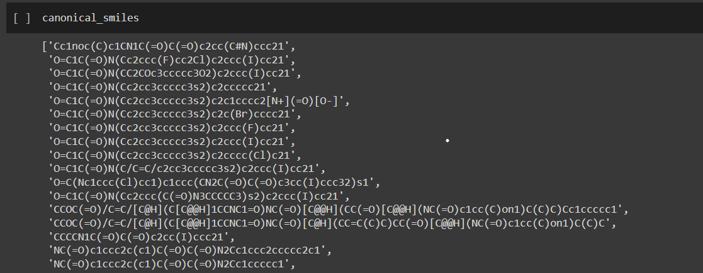
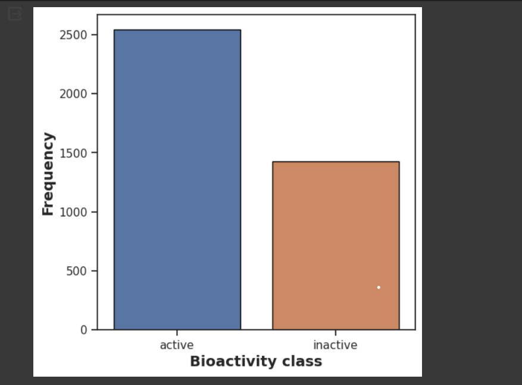
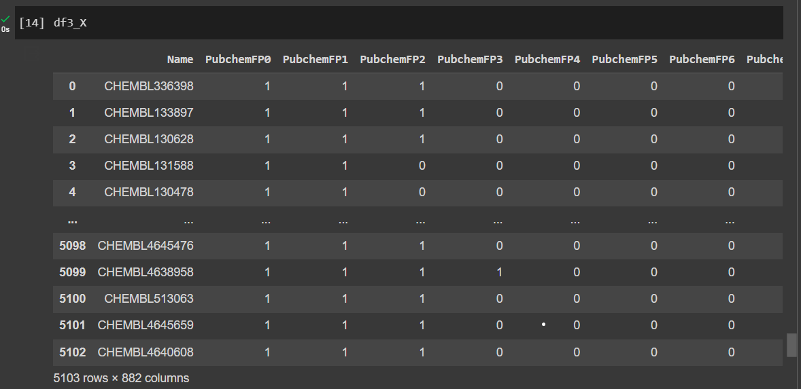
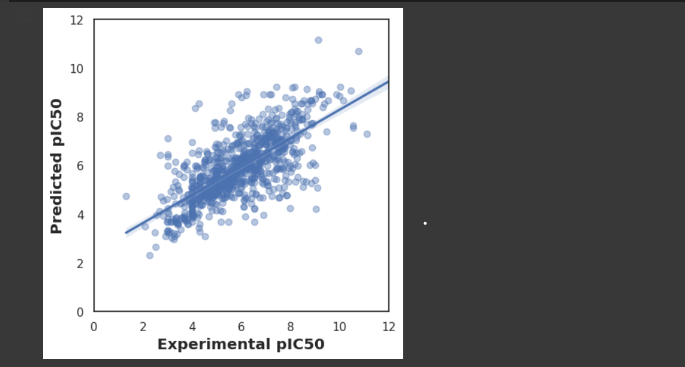

# Bioinformatics Drug Discovery Project

## Overview
This project aims to utilize bioinformatics techniques for drug discovery, specifically focusing on identifying potential drug candidates through computational methods. The project involves the analysis of chemical compounds, prediction of their bioactivity, and comparison with experimental data to validate the predictions.

## Repository Contents
- **data**: Contains datasets of chemical compounds with associated bioactivity and other relevant information.
- **scripts**: Includes Python scripts for data preprocessing, model training, and evaluation.
- **models**: Stores trained machine learning models for bioactivity prediction.
- **results**: Holds the results of bioactivity prediction experiments.
- **README.md**: This file provides an overview of the project and instructions for usage.

## Screenshots

### 1. Chemical Structure Using SMILES Notation

This screenshot displays the chemical structure of a compound represented using the Simplified Molecular Input Line Entry System (SMILES) notation. SMILES is a string representation of a chemical structure, providing a compact and human-readable format for molecular structures.

### 2. Graph Showing Bioactivity

The graph illustrates the bioactivity of compounds based on their classification as active or inactive. Bioactivity refers to the ability of a compound to exert a specific biological effect, such as inhibiting a target protein associated with a disease. This graph helps in visualizing the distribution of active and inactive compounds in the dataset.

### 3. Dataset with PubChem Representation

This screenshot presents a portion of the dataset with representations of chemical compounds using PubChem Compound Identifiers. PubChem is a database of chemical molecules maintained by the National Center for Biotechnology Information (NCBI). The dataset contains various attributes of compounds, including molecular properties and bioactivity information.

### 4. Predicted vs. Experimental pIC50 Value

The screenshot compares the predicted and experimental pIC50 values of compounds. pIC50 is a measure of the potency of a compound in inhibiting a biological target, commonly used in drug discovery. This visualization helps assess the performance of machine learning models in predicting bioactivity, by comparing their predictions with experimental data.

